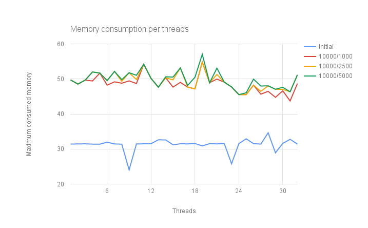

Test runs using `httperf` on S2I Ruby hello world application. Data series are
marked with total connections and rate of connections per second (`--num-conns`
and `--rate` respectively). Memory is in MiB.

